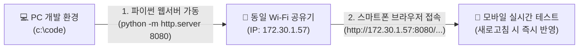

# 🚀 [개발 일지] Cosmic Striker 구글 스토어 상용화 1단계 개발 보고서
> **작성 일자**: 2026년 9월 19일 (토)  
> **프로젝트**: Cosmic Striker (2D 횡스크롤 우주 슈팅 게임)  
> **개발 환경**: HTML5 Canvas, Web Audio API, Vanilla JavaScript, CSS3 Glassmorphism  
> **작업 파일**: `game_shooting_0919.html`  

---

## 📌 1. 프로젝트 개요 및 배경 (Overview)

기존에 개발된 **Cosmic Striker (2D 횡스크롤 우주 슈팅 게임)**는 PC 브라우저 환경에서 키보드(W/A/S/D)와 마우스 연사, 10레벨 난이도 시스템, 보호막 부활, 비밀 치트키(F1) 등 우수한 코어 메커니즘을 갖추고 있었습니다.

하지만 **"구글 플레이스토어에 정식 출시 가능한 상용 모바일 게임"**으로 탈바꿈하기 위해서는 **모바일 터치 조작감, 사운드와 카메라 연출(Juiciness), 보스전, 메타 시스템 등 대대적인 퀄리티 업그레이드**가 필수적이었습니다.

이에 따라 **6대 핵심 영역 업그레이드 마스터 플랜**을 수립하고, 오늘(09/19) **최우선 1단계인 [모바일 1:1 터치 조작 & 핑거 오프셋 & 화면 우하단 폭탄(Bomb) 버튼] 개발**을 완료하였습니다.

---

## 📋 2. 상용화 업그레이드 마스터 플랜 (Master Plan)

### 6대 핵심 영역 및 개발 우선순위 테이블

| 번호 | 핵심 영역 | 세부 개선 항목 | 상세 기획 내용 | 기대 효과 | 개발 우선순위 |
| :---: | :--- | :--- | :--- | :--- | :---: |
| **1** | **모바일 조작 & UI** | 1:1 터치 드래그 & 핑거 오프셋 | 손가락 이동에 맞춰 기체가 즉각 추종하며, 시야 가림 방지 위해 손가락 전방 25px 배치 | 모바일 조작 피로도 제로화, 직관적 컨트롤 | **1순위 (Phase 1 / 완료)** |
| | | 모바일 전용 폭탄(Bomb) 버튼 | 위기 탈출용 궁극기 버튼 터치 UI 화면 우하단 배치 (게임당 2회) | 모바일 환경의 긴급 회피 수단 제공 | **1순위 (Phase 1 / 완료)** |
| | | 햅틱 피드백 | 적 처치 및 피격 시 스마트폰 미세 진동(`navigator.vibrate`) 연동 | 손끝으로 전해지는 리얼한 물리 타격감 | **3순위 (Phase 1)** |
| **2** | **청각 & 타격감 (Juiciness)** | Web Audio 신스 SFX / BGM | 외부 오디오 로딩 없는 순수 웹 오디오 신스음 (발사, 폭발, 사이렌, 승리 BGM) | 게임 몰입도 및 완성도 300% 상승 | **2순위 (Phase 1)** |
| | | 카메라 쉐이크 & 피격 플래시 | 적 타격 시 0.05초 화이트 점멸(Hit Flash), 대형 폭발 시 화면 진동 | 시각적 타격감 및 피격 인지 극대화 | **2순위 (Phase 1)** |
| | | 히트스톱 (Hit Stop) | 보스 처치나 강력한 피격 순간 0.1초 정지 후 대폭발 연출 | 아케이드 특유의 묵직한 쾌감 부여 | **2순위 (Phase 1)** |
| **3** | **아이템 & 파워업** | 파워업 캡슐 드랍 | 듀얼 레이저 ➔ 트리플 확산탄 ➔ 유도 미사일 단계별 공격력 강화 | 성장감 제공 및 플레이 스타일 다변화 | **4순위 (Phase 2)** |
| | | 서포트 아이템 | 화면 전체 탄환 소멸 폭탄, 자석(골드 자동 흡수), 방어막 리필 | 위기 돌파 및 전략적 플레이 유도 | **4순위 (Phase 2)** |
| **4** | **보스전 & 적 패턴** | 10레벨 거대 모선(Mother Ship) | 화면 절반 크기의 보스, 상단 체력바(HP Bar), 부위별 파괴 연출 | 엔딩 직전 최고의 긴장감과 성취감 조성 | **3순위 (Phase 1)** |
| | | 다단계 보스 탄막 패턴 | 원형 탄막, 충전 레이저 빔 발사, 호위 드론 사출 | 단순 회피를 넘어 패턴 공략의 재미 제공 | **3순위 (Phase 1)** |
| | | 엘리트/자폭 적 기체 | 플레이어를 향해 돌진하는 자폭선, 전방 쉴드 전함 | 단조로운 스폰 탈피 및 우선 타격 대상 부여 | **5순위 (Phase 2)** |
| **5** | **메타 시스템 (성장/저장)** | 골드 재화 & 격납고(Hangar) | 적 격추 시 드랍되는 골드로 기체 영구 업그레이드 (공격력, 이동속도, 쉴드시간) | 반복 플레이 동기(Retention) 극대화 | **6순위 (Phase 3)** |
| | | 로컬 세이브 & 최고기록 갱신 | `localStorage` 기반 최고 점수, 보유 골드, 클리어 이력 자동 저장 | 플레이어 데이터 보존 및 성취 지표 제공 | **5순위 (Phase 2)** |
| **6** | **3D 개선 (Visual Evolution)** | 의사 3D (Pseudo-3D) / 롤링 애니메이션 | 기체 상하 이동 시 좌우 롤링(Banking) 3D 틸트 및 다중 배경 원근감(Parallax Depth) | 평면 2D를 벗어나 현대적인 공간감 부여 | **7순위 (Phase 4)** |
| | | WebGL / Three.js 3D 모델링 | 기체 및 거대 보스를 3D 폴리곤 모델로 교체하고 동적 조명 렌더링 | 구글 스토어 등록 시 압도적인 그래픽 어필 | **7순위 (Phase 4)** |

---

## 🛠️ 3. 오늘(09/19) 구현 내용 및 기술적 의사결정

### ① 작업 파일 분기 (`game_shooting_0919.html`)
- 기존 안정 버전 `game_shoot.html`을 보존하면서, 2026-09-19 날짜 접미사를 붙인 독립 실행형 파일 **`game_shooting_0919.html`**을 신규 생성하여 작업 진행.

### ② 모바일 1:1 터치 드래그 추종 조작계 (Direct Touch Following)
- **문제점**: 모바일 화면에서 가상 조이스틱 버튼을 누르는 방식은 조작 피로도가 높고 긴박한 탄막 슈팅 환경에서 반응이 늦음.
- **구현 방식**:
  - `touchstart`, `touchmove`, `touchend` 터치 이벤트를 등록.
  - 캔버스의 실제 렌더링 크기(`getBoundingClientRect`)와 내부 해상도(`960x540`) 사이의 비율(Scale Factor)을 정밀 계산.
  - 화면 어디를 터치하고 드래그하든 비행기가 손가락 이동 변위($\Delta x, \Delta y$)를 즉각 1:1로 추종하도록 상대 좌표 드래그(Relative Drag) 로직 구현.

### ③ 핑거 오프셋 (Finger Offset - 전방 +30px, 상향 -15px)
- **모바일 슈팅의 핵심 UX 디테일**:
  - 스마트폰 화면에서 손가락이 비행기 바로 위에 위치하면, 내 손가락이 비행기와 전방에서 날아오는 레이저를 가려버리는 치명적인 문제가 발생함.
  - **해결**: 손가락 터치 지점보다 **전방으로 30px, 위쪽으로 15px 떨어진 위치에 비행기를 배치**하는 오프셋 연산을 적용.
  - **결과**: 엄지손가락에 가려지지 않고 날아오는 적 탄환을 100% 시야로 확보하면서 정밀 회피 가능.

### ④ 터치 중 자동 연사 (Auto-Fire on Touch)
- 화면을 터치하여 비행기를 조작하는 동안 별도의 발사 버튼을 누를 필요 없이 **플라즈마 레이저가 쾌속 자동 발사**되도록 연동하여 한 손 조작 편의성을 극대화.

### ⑤ 화면 클리어 폭탄(Bomb) 시스템 및 UI
- **UI 디자인**:
  - 화면 우측 하단에 엄지손가락으로 즉시 터치할 수 있는 네온 레드 글래스 형태의 **원형 폭탄 버튼 (`💣 BOMB x2`)** 배치.
  - 상단 HUD 상태창에도 실시간 잔여 폭탄 수량(`💣 x2`) 동기화.
- **폭탄 발동 메커니즘 (`triggerBomb()`)**:
  1. **충격파 연출**: 폭탄 발동 즉시 플레이어 위치로부터 화면 전체로 팽창하는 2중 충격파 링(`Shockwave` 클래스 - 외곽 레드 화염링 + 내부 네온 시안링) 생성.
  2. **탄환 소멸**: 현재 화면에 날아다니는 **모든 적 레이저를 즉시 증발**시키고 소멸 파티클 분출.
  3. **전체 광역 타격**: 화면에 존재하는 모든 외계 UFO에게 **5의 강력한 데미지**를 일괄 타격하여 약한 적은 즉시 폭파 격추.
  4. **안전 무적 쉴드**: 폭탄 발동 직후 긴급 회피를 위해 **1.5초간 무적 보호막** 부여.
  5. **PC 키보드 연동**: PC 플레이 시에는 키보드 <kbd>B</kbd> 또는 <kbd>E</kbd> 키로도 발동 가능.

### ⑥ 모바일 반응형 뷰포트 & 터치 스크롤 방지
- 모바일 브라우저 특유의 화면 확대/축소 핀치 줌 및 화면 당겨서 새로고침 제스처가 게임 조작을 방해하지 않도록 **`touch-action: none;`** 및 **`-webkit-user-select: none;`** 강제 적용.
- CSS `aspect-ratio: 16 / 9` 및 `max-width: 100vw; max-height: 100vh;` 설정을 통해 가로/세로 어느 회전 모드에서도 화면이 깨지거나 잘리지 않고 완벽하게 중앙 정렬 스케일링되도록 반응형 튜닝.

---

## 📱 4. 모바일 실시간 테스트 파이프라인 구축

개발과 동시에 실제 스마트폰에서 0.1초 만에 테스트할 수 있는 **로컬 Wi-Fi 서버 환경**을 구축 및 검증하였습니다:

- **접속 주소**: `http://172.30.1.57:8080/game_shooting_0919.html`
- **테스트 편의성**: PC에서 코드를 수정하고 스마트폰 브라우저에서 '새로고침'만 누르면 즉각 모바일 환경에서 플레이 테스트 가능.
- **서버 상태**: 금일 작업 완료 후 포트 8080 백그라운드 서버 정상 안전 종료.

---

## 🎯 5. 다음 세션 개발 계획 (Next Step)

마스터 플랜에 따라 다음 복귀 시 **Phase 1의 2순위 및 3순위**를 이어서 착수할 예정입니다:

1. **2순위: 청각 & 타격감 "Juiciness" 연출**:
   - Web Audio API 기반 신스 SFX (피우~ 레이저음, 쾅 폭발음, 경고 사이렌, 승리 팡파르, 우주 테마 BGM) 내장.
   - 적 피격 시 0.05초 화이트 점멸(Hit Flash).
   - 대형 폭발 및 폭탄 사용 시 화면 흔들림(Camera Shake).
   - 보스 처치 순간 0.1초 정지 연출(Hit Stop).
2. **3순위: 10레벨 거대 모선(Mother Ship) 보스전**:
   - 상단 체력바(HP Bar) 표시.
   - 다단계 탄막 패턴(원형 확산탄, 레이저 충전 빔).
   - 스마트폰 햅틱 진동(`navigator.vibrate`) 연동.

---

*본 문서는 향후 기술 블로그(Naver Blog, Tistory, Velog), 깃허브 포트폴리오 리포지토리 및 게임 개발 포스트용 공식 아카이브로 활용됩니다.*

