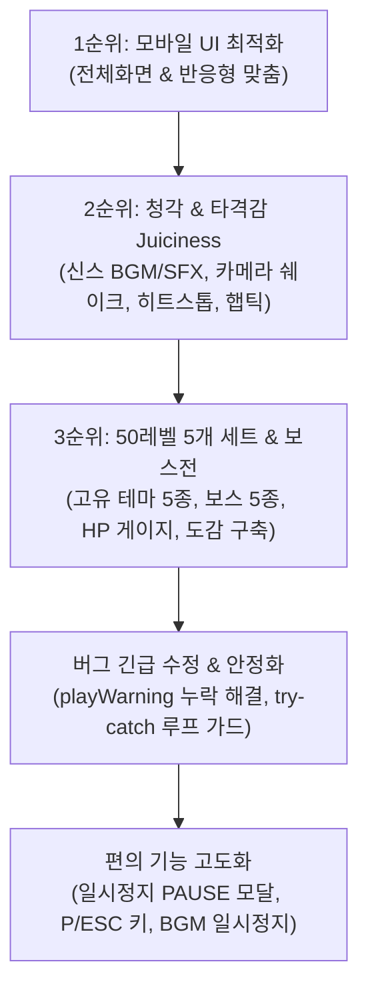

# 🚀 [개발 일지] Cosmic Striker 상용화 2~3단계 및 대규모 시스템 확장 보고서
> **작성 일자**: 2026년 10월 8일  
> **프로젝트**: Cosmic Striker (2D 횡스크롤 우주 탄막 슈팅 게임)  
> **개발 환경**: HTML5 Canvas, Web Audio API, Vanilla JavaScript, CSS3 Glassmorphism  
> **작업 기준 파일**: `game_shooting_0919.html`  
> **관련 리소스**: `assets/` (세트별 배경/보스 10종), `stage_showcase.html` (도감 웹페이지)

---

## 📌 1. 오늘 작업 개요 (Today's Summary)

오늘 세션에서는 **Phase 1 (상용화 기반 구축)**의 잔여 필수 과제인 **2순위 (청각 & 아케이드 타격감 Juiciness)** 및 **3순위 (50레벨 대규모 확장 & 5개 세트별 우주 테마 및 고유 보스전)**를 모두 완수하였습니다.  
이후 실제 모바일 기기 테스트 중 발견된 **10레벨 보스 진입 시 프리징(Crash) 버그를 완벽히 분석 및 해결**하였으며, 유저 편의를 위한 **게임 일시정지(PAUSE/스톱) 시스템**을 새롭게 설계·반영하였습니다.

---

## 🛠️ 2. 오늘 주요 구현 및 업그레이드 상세 내역

### 1) 모바일 풀스크린 및 뷰포트 맞춤 (UI 고도화)
* **모바일 전체화면 자동 전환 (Fullscreen API)**:
  * 모바일 기기에서 게임 시작 버튼 터치 시 브라우저 상단 URL 주소창과 하단 툴바가 자동으로 숨겨지며 100% 몰입형 전체화면 모드로 진입.
  * 상단 컨트롤 바에 `[⛶ 전체화면]` 토글 버튼 상시 배치.
* **스마트폰 반응형 화면 맞춤 (`@media`)**:
  * 소형 스마트폰 가로 모드에서도 시작 안내 화면 및 게임오버 화면이 잘리지 않도록 폰트 크기 및 패딩 동적 최적화.

---

### 2) 2순위: 청각 & 아케이드 타격감 (Juiciness) 완성
* **Web Audio API 프로시저럴 레트로 신스 오디오 엔진**:
  * 외부 MP3/WAV 파일 로딩(용량 0MB, 로딩 딜레이 0초) 없이 순수 브라우저 오디오 오실레이터로 실시간 음파 합성.
  * **BGM**: 16스텝 120BPM 사이버펑크 아케이드 신스 베이스라인 & 몽환적 아르페지오 무한 루프.
  * **SFX**: 레이저 발사음(`playShoot`), 적 피격 틱음(`playHitEnemy`), 소형/대형 폭발음(`playExplosion`, `playHeavyExplosion`), 서브우퍼 폭탄 드롭음(`playBomb`), 레벨업/승리 팡파르(`playLevelUp`, `playVictory`).
* **시각적·물리적 타격 연출 극대화**:
  * **카메라 쉐이크 (Camera Shake)**: 적 격추(6~12px), 폭탄 투하(20px), 플레이어 피격 시 캔버스 좌표를 즉각 진동시켜 타격감 전달 (외곽 여백 클리핑 방지 마진 +80px 적용).
  * **화이트 플래시 (Hit Flash)**: 탄환 명중 시 0.05초간 적 기체가 고휘도 화이트로 번쩍여 적중 인지율 극대화.
  * **히트 스톱 (Hit Stop)**: 대형 전함 파괴 및 폭탄 발동 순간 물리 프레임을 0.05~0.1초 순간 정지시켜 묵직한 아케이드 쾌감 구현.
  * **모바일 햅틱 진동 (`navigator.vibrate`)**: 피격, 대형 적 격파, 폭탄 발동 시 스마트폰 진동 모터 연동.

---

### 3) 3순위: 50레벨 확장 & 5개 세트별 우주 테마 및 고유 보스전

기존 10레벨 단일 구성을 **총 50레벨, 10레벨 단위 5개 독립 세트 구조**로 대폭 확장하였습니다. 각 세트는 고유한 우주 배경 스타일과 차별화된 디자인 및 탄막 패턴을 지닌 거대 보스를 보유합니다.

| 세트 | 레벨 범위 | 우주 테마 배경 | 고유 보스 전함 명칭 | 보스 HP | 고유 탄막 및 전투 패턴 |
| :---: | :---: | :--- | :--- | :---: | :--- |
| **SET 1** | Lv. 1 ~ 10 | **시안 네뷸라** (딥 시안 & 고리 행성) | **GIGA CRUISER** [Azure Overlord] | **45 HP** | 상하 듀얼 플라즈마포 + 3점사 부채꼴 탄막 (광폭화 시 탄속 급증) |
| **SET 2** | Lv. 11 ~ 20 | **크림슨 초신성** (작열하는 플라즈마 폭풍) | **INFERNO DREADNOUGHT** [Blaze Behemoth] | **70 HP** | 중장갑 마그마 레일건 2열 + 4연장 분열 화염탄 (광폭화 시 5방향 마그마 폭풍 난사) |
| **SET 3** | Lv. 21 ~ 30 | **에메랄드 소행성대** (오로라 펄서 & 독성 소행성) | **VIPER HIVE CARRIER** [Toxin Queen] | **95 HP** | 5방향 맹독 스프레드 + 플레이어 정밀 조준탄 (광폭화 시 S자 사인파 맹독 침 연사) |
| **SET 4** | Lv. 31 ~ 40 | **골든 펄서 성운** (황금빛 자기장 & 코로나) | **SOLARIS IRON FORTRESS** [Aegis Citadel] | **130 HP** | 8방향 회전 태양꽃 탄막 + 3연장 중포 (광폭화 시 12방향 전방위 태양 폭발 세례) |
| **SET 5** | Lv. 41 ~ 50 | **보이드 사건지평선** (초대질량 블랙홀 왜곡 지평선) | **VOID TITAN EMPEROR** [Chronos Omega - FINAL] | **175 HP** | 중심 블랙홀 특이점 나선 탄막 + 7방향 중력파 (광폭화 시 플레이어 예측 3열 요격탄) |

* **보스전 시스템 세부 구현**:
  * **상단 보스 전용 실시간 HUD 게이지 (`#boss-hud`)**: 보스 명칭 및 실시간 잔여 HP 바(`100% ➔ 0%`) 표출 (체력 감소 시 붉은색 경고 색상으로 변화).
  * **보스전 돌입 연출**: 보스 스테이지 진입 시 일반 적 스폰 일시 정지, WARNING 사이렌 경보음 울림 및 카메라 화면 진동.
  * **특수 무기 상호작용**: 폭탄(`💣 BOMB`) 사용 시 보스에게 15 직격 대미지, 에너지 쉴드 몸통 박치기 시 2 지속 대미지.
  * **보스 격침 연출**: 8단계 연쇄 다중 폭발, 히트스톱, 햅틱 롱 진동 후 세트 클리어 축하 배너 출력.
* **시각 자산 및 도감 페이지 구축**:
  * AI 기반 세트별 배경 및 보스 고유 이미지 10종 생성 및 저장 (`assets/set1_bg.jpg` ~ `set5_boss.jpg`).
  * 세트별 상세 스펙과 컨셉 아트를 모바일/PC에서 한눈에 열람 가능한 도감 페이지 **`stage_showcase.html`** 신규 제작.

---

### 4) 버그 분석 및 긴급 조치: 9단계 종료 시 프리징(Crash) 해결
* **발생 현상**: 유저 실기 테스트 중 9단계를 클리어하고 10단계로 넘어가는 순간 화면과 모든 조작이 멈추는 현상 발생.
* **원인 규명**:
  * 9단계 타이머 종료 후 10단계(보스 스테이지)로 진입하면서 `this.spawnBoss()`가 실행됨.
  * 보스 경보음을 재생하기 위해 `sounds.playWarning()`을 호출하였으나, `SoundEngine` 클래스 내에 해당 메서드가 구현되어 있지 않아 자바스크립트 `TypeError: sounds.playWarning is not a function` 런타임 에러 발생.
  * 브라우저의 `requestAnimationFrame` 루프가 즉각 중단되어 화면 렌더링과 터치 입력이 일제히 정지됨.
* **해결 조치**:
  1. `SoundEngine`에 하강 톱니파 듀얼 사이렌 경보음 `playWarning()`을 정식 구현.
  2. 사운드 호출부에 함수 존재 여부를 검증하는 안전 방어 코드 탑재.
  3. 메인 게임 루프 `loop()`에 `try...catch` 예외 처리 블록을 감싸 향후 어떠한 예외 상황이 발생하더라도 렌더링 프레임 루프가 영구 정지되지 않도록 원천 보호.

---

### 5) 사용자 편의 기능: 게임 일시정지 (PAUSE / 스톱) 시스템 신규 구축
장시간 50레벨 플레이 시 발생하는 피로도를 해소하기 위해 언제든 휴식할 수 있는 일시정지 시스템을 완성하였습니다.

* **상단 컨트롤 바 `[⏸️ 정지]` 버튼**:
  * 모바일 터치 및 PC 클릭이 용이하도록 상단 우측에 황금색 테두리 버튼 배치.
  * 게임 중 터치 시 즉각 정지되며, 정지 상태에서는 `[▶️ 재개]` 버튼으로 자동 전환.
* **PC 키보드 단축키 연동**:
  * <kbd>P</kbd> 키 또는 <kbd>ESC</kbd> 키 입력 시 즉각 일시정지 / 재개 토글.
* **사이버펑크 일시정지 모달 화면 (`#pause-screen`)**:
  * 화면 블러 처리와 함께 현재 진행 단계(`LV. X / 50 • [SET Y (보스전 여부)]`), 현재 점수, 남은 라이프(`♥♥♥`), 폭탄 개수 표출.
  * **`▶ 계속하기 (RESUME)`**: 기체 위치, 탄환, 보스 체력 상태 그대로 즉시 게임 재개.
  * **`🔄 처음부터 다시`**: 원할 경우 첫 스테이지부터 재도전.
* **상태 및 오디오 안전 동기화**:
  * 정지 시 BGM 일시정지(`pauseBGM()`), 재개 시 자연스러운 재생 재개(`resumeBGM()`).
  * 정지 해제 시 터치 드래그 위치 튐 현상을 방지하기 위한 터치 상태 안전 리셋.

---

## 📊 3. 마스터 플랜 대비 현재 개발 진행률

| 순위 | 단계 및 세부 항목 | 현재 상태 | 비고 |
| :---: | :--- | :---: | :--- |
| **1순위** | **모바일 조작 & UI** (1:1 터치, 핑거 오프셋, 폭탄 버튼, 전체화면, 반응형) | **✅ 100% 완료** | 모바일 플레이 테스트 검증 완료 |
| **2순위** | **청각 & 타격감 Juiciness** (Web Audio 신스 BGM/SFX, 쉐이크, 플래시, 히트스톱, 햅틱) | **✅ 100% 완료** | 무용량 합성 오디오 엔진 탑재 |
| **3순위** | **보스전 & 50레벨 확장** (5개 세트 우주 테마, 고유 보스 5종, HP바, 일시정지) | **✅ 100% 완료** | 프리징 버그 수정 및 안정화 완료 |
| **4순위** | **파워업 캡슐 드랍 시스템** (듀얼 ➔ 트리플 확산 ➔ 유도 미사일 강화, 서포트 아이템) | **대기 중 (Next)** | Phase 2 착수 예정 |
| **5순위** | **적 기체 다변화 & 로컬 세이브** (돌진 자폭 UFO, 전방 실드선, 최고기록 세이브) | **대기 중** | Phase 2 |
| **6순위** | **메타 시스템 (격납고 & 골드 재화)** (기체 능력치 영구 업그레이드) | **대기 중** | Phase 3 |
| **7순위** | **3D 롤링(Banking) 애니메이션 & 배경 원근감** (공간감 고도화) | **대기 중** | Phase 4 |

---

## 📱 4. 실시간 테스트 환경 및 주요 파일 현황

* **작업 및 실행 파일**:
  * 메인 게임: [game_shooting_0919.html](file:///c:/code/game_shooting_0919.html)
  * 보스 & 스테이지 도감: [stage_showcase.html](file:///c:/code/stage_showcase.html)
  * 비주얼 자산 디렉토리: `c:\code\assets\` (배경 및 보스 이미지 총 10장)
* **모바일 접속 주소 (동일 Wi-Fi LAN)**:
  * 게임 플레이: `http://172.30.1.26:8080/game_shooting_0919.html`
  * 스테이지 도감: `http://172.30.1.26:8080/stage_showcase.html`
* **테스트 편의 기능 (히든 치트키)**:
  * PC 키보드 <kbd>F1</kbd>: 10초간 무적 에너지 쉴드 발동 (고레벨 보스전 패턴 테스트용)
  * PC 키보드 <kbd>P</kbd> / <kbd>ESC</kbd>: 즉시 게임 일시정지 및 휴식

---

## 🎯 5. 다음 세션 개발 목표 (Next Milestone)

다음 세션에서는 **Phase 2 (아이템 및 파워업 시스템)**로 넘어가 유저의 화력 성장과 무기 교체의 재미를 더할 예정입니다:
1. **파워업 캡슐 드랍 메커니즘**:
   * 특정 적 UFO 격추 시 알파벳 캡슐([P] 파워업, [S] 쉴드, [B] 폭탄 리필) 드랍.
2. **단계별 공격 모드 진화**:
   * 1단계: 기본 듀얼 플라즈마 레이저
   * 2단계: 3열 트리플 확산 레이저 (넓은 범위 요격)
   * 3단계: 전방 레이저 + 좌우 유도 미사일(Homing Missile) 발사
3. **엘리트 적 패턴 추가**:
   * 자폭형 초고속 돌진 드론 및 전방 편향 방어막 전함 추가.

