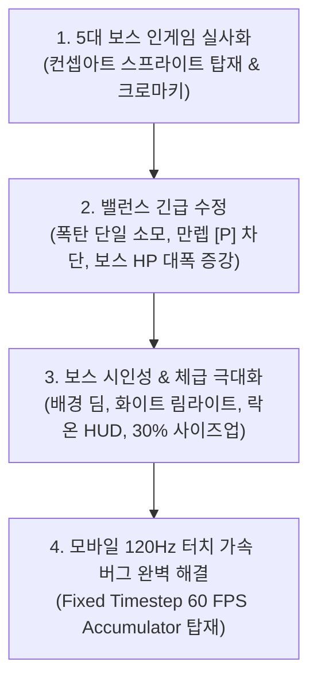

# 🚀 [개발 일지] Cosmic Striker 보스 비주얼 실사화, 밸런스 개선 및 모바일 최적화 보고서
> **작성 일자**: 2026년 10월 9일 (금)  
> **프로젝트**: Cosmic Striker (2D 횡스크롤 우주 탄막 슈팅 게임)  
> **개발 환경**: HTML5 Canvas, Web Audio API, Vanilla JavaScript, CSS3 Glassmorphism  
> **작업 기준 파일**: `game_shooting_0919.html`  
> **테스트 서버 환경**: Python HTTP Server (Port 8080, PC/모바일 로컬 Wi-Fi 연동)  

---

## 📌 1. 오늘 작업 개요 (Today's Summary)

오늘 세션에서는 실전 플레이 테스트를 통해 도출된 핵심 피드백들을 집중적으로 개선하고, 게임의 시각적·시스템적 완성도를 상용 출시급으로 끌어올리는 대규모 고도화 작업을 완수하였습니다.

1. **5대 보스 인게임 실사화**: 단순 라인 벡터였던 보스를 고해상도 컨셉 아트 기반의 실사형 기함 스프라이트로 전격 교체 (크로마키 투명화, 조준 틸팅, 추진체 분사).
2. **핵심 게임플레이 밸런스 개선**: 폭탄 단일 소모 버그 픽스, 무기 Lv.3 도달 시 무의미한 [P] 캡슐 드랍 차단, 보스 HP 6~9배 대폭 상향(장기전 탄막 대전 성립).
3. **보스 시인성 극대화 & 30% 사이즈업**: 배경 성운과의 색상 동화(카무플라주) 현상 해결을 위해 배경 딤(0.16) + 화이트 림 라이트 + 사이버틱 락온 HUD + 선체 30% 확대를 동시 적용.
4. **모바일 120Hz 가변 주사율 터치 가속 버그 해결**: 스마트폰 터치 시 화면 주사율이 120Hz로 점프하며 게임 전체 속도가 2배로 빨라지던 현상을 분석하고, 상용 엔진급 고정 타임스텝(Fixed Timestep 60 FPS)을 구축하여 속도 완벽 고정.

---

## 🛠️ 2. 오늘 주요 구현 및 업그레이드 상세 내역

### 1) 5대 보스 인게임 실사화 & 크로마키 투명화 파이프라인
* **배경 및 문제점**:
  * 기존 보스는 캔버스 라인 드로잉(선화)으로만 렌더링되어, 화려한 우주 배경 및 컨셉 아트 대비 위압감과 디테일이 부족했음.
* **구현 내용**:
  * 각 세트별 보스 컨셉 아트 이미지를 인게임 스프라이트로 렌더링하도록 `BossShip` 클래스 전면 리팩토링.
  * **오프스크린 캔버스 크로마키 (Chroma-Keying)**:
    * 원본 컨셉 아트의 순수 검은 배경(Black Pixel)을 RGB 밝기 기반으로 계산하여 알파(투명도) 0으로 실시간 변환하는 투명화 파이프라인 구축.
  * **다이내믹 전투 애니메이션**:
    * Set 1~3, 5: 플레이어 위치를 향해 기수가 미세 틸팅 각도(`baseAngle`)로 조준 비행.
    * Set 4 (황금 요새): 거대 궤도 요새 특유의 360도 천천히 회전하는 battlestation 애니메이션.
    * 후방 엔진 추진체에서 각 세트 속성 색상(시안, 화염, 맹독, 골드, 바이올렛)의 플라즈마 파티클 연속 방출.
    * 기체 중심부에 박동하는 중앙 동력로(Plasma Reactor Core) 발광 효과 부여.

---

### 2) 실전 테스트 피드백 3종 긴급 개선

#### ① 폭탄 1회 사용 시 일괄 소진 버그 수정 (개수별 독립 사용 보장)
* **원인**: 모바일 터치 이벤트(`touchstart`, `pointerdown`) 중복 발생 및 PC 키보드 키 반복(Key Repeat)으로 인해 수십 밀리초 내에 `triggerBomb()`이 연속 호출되어 보유 폭탄이 한 번에 0개로 소진됨.
* **조치**:
  * `this.bombCooldown = 25` (~0.4초) 내부 쿨다운 타이머 설정.
  * 키보드 `keydown` 이벤트에 `if (e.repeat) return;` 방어 로직 추가.
  * 모바일 터치 버튼에 400ms 타임스탬프 디바운스 적용.
  * 최대 폭탄 비축 슬롯을 `maxBombs = 5`로 확장 (기본 2개 시작).
* **결과**: 폭탄이 몇 개든 **버튼을 누를 때마다 정확히 1개씩만 차감**되어 전략적 분할 사용 가능.

#### ② 무기 만렙(Lv.3) 도달 시 [P] 캡슐 드랍 차단
* **원인**: 이미 Lv.3 하이퍼 무기 상태인데도 불필요한 [P] 파워업 캡슐이 계속 드랍되어 낭비됨.
* **조치**:
  * `maybeSpawnCapsule()` 및 보스 처치 드랍 시 `player.weaponLevel >= 3`인지 판별.
  * 만렙 상태에서는 **[P] 캡슐 드랍을 100% 차단**하고, **무적 쉴드 [S] (5초)**나 **폭탄 충전 [B]** 캡슐로 자동 대체.
  * 피격되어 무기가 Lv.2로 내려가면 다시 [P] 캡슐이 자연스럽게 드랍되어 복구 가능.

#### ③ 5대 보스 HP 6~9배 대폭 증강 & 진입 보호
* **원인**: 플레이어가 Lv.3 풀무기 상태로 진입 시 기존 45 HP였던 보스가 1~2초 만에 즉사하여 보스전의 재미와 긴장감이 전무했음.
* **조치**:
  * 보스 HP를 대폭 상향하여 15~40초 이상의 긴장감 넘치는 탄막 회피 대전으로 재밸런싱:
    * **SET 1 보스 (Lv.10)**: 45 HP ➡️ **280 HP** (~6.2배 증가)
    * **SET 2 보스 (Lv.20)**: 70 HP ➡️ **500 HP** (~7.1배 증가)
    * **SET 3 보스 (Lv.30)**: 95 HP ➡️ **800 HP** (~8.4배 증가)
    * **SET 4 보스 (Lv.40)**: 130 HP ➡️ **1,200 HP** (~9.2배 증가)
    * **SET 5 보스 (Lv.50, 최종보스)**: 175 HP ➡️ **1,700 HP** (~9.7배 증가)
  * **화면 진입 완료 보호**: 보스가 우측에서 화면 안으로 완전히 전진 진입(`entered = true`)하기 전에는 총알/미사일/폭탄 대미지를 받지 않도록 무적 보호.
  * **폭탄 대미지 상향**: 보스 대상 폭탄 대미지를 기존 15 ➡️ **35 HP**로 상향 조정.

---

### 3) 보스 시인성 극대화 & 30% 체급 사이즈업 (카무플라주 현상 해결)
* **배경 및 문제점**:
  * 각 세트별 배경 성운의 주 색상과 보스 기체의 테마 색상이 유사하여, 보스 출현 시 배경에 묻혀 눈에 잘 띄지 않는 식별성 저하 발생.
* **구현 조합**:
  1. **배경 딤(Dimming) & 암흑 비네트**:
     * 보스전 돌입 시 배경 성운의 투명도를 기존 `0.50`에서 **`0.16`으로 극적인 딤 처리**.
     * 화면 전체에 방사형 암흑 그라디언트 비네트(`rgba(2, 6, 18, 0.40) ~ rgba(0, 2, 8, 0.78)`)를 씌워 전장 분위기를 어둡고 비장하게 전환.
  2. **고휘도 화이트 림 라이트(Rim Light) & 명암 부스트**:
     * 캔버스 필터를 통해 선체 실루엣 외곽에 눈부신 백색 윤곽광(`drop-shadow(0 0 12px #ffffff)`)과 테마 컬러 아우라 동시 발광.
     * `brightness(1.25) contrast(1.22)` 명암 부스트로 어두운 우주 배경과 선체 장갑판을 선명하게 분리.
  3. **SFX 전술 락온 타겟 브래킷 HUD (Tactical Reticle)**:
     * 보스 선체를 둘러싸는 4방향 코너 꺾쇠 브래킷 `[   ]` 및 조준선 틱 렌더링.
     * 상단 경고 HUD: **`[ ⚠️ TARGET LOCKED: 보스기함명 ]`** 네온 앰버 발광.
     * 하단 상태 HUD: **`HULL: 잔여HP% | THREAT: CRITICAL`** (HP 30% 이하 시 적색 점멸).
  4. **보스 기체 약 30% 사이즈업**:
     * Set 1, 2, 3, 5: `215 x 185` ➡️ **`285 x 245` (+33%)**
     * Set 4: `200 x 200` ➡️ **`275 x 275` (+37.5%)**
     * 화면 세로 높이(540px)의 약 45%를 차지하여 오락실 슈팅 게임 특유의 압도적인 거대 모선 체급 구현.

---

### 4) 모바일 120Hz 가변 주사율 터치 가속 버그 해결
* **원인 규명**:
  * 갤럭시(최적화 120Hz), 아이폰(ProMotion 120Hz) 등 최신 스마트폰은 평소 배터리 절약을 위해 화면 주사율을 **60Hz**로 유지하다가, 사용자가 화면을 **터치하는 순간 OS가 즉시 120Hz**로 2배 끌어올림.
  * 기존 코드가 브라우저 화면 갱신 주기(`requestAnimationFrame`)에 맞춰 프레임당 1회씩 게임 로직(`update()`)을 실행하고 있었기 때문에, **터치하는 순간 게임 전체 속도가 정확히 2배속으로 폭주**하는 현상이 발생함.
* **해결 조치 (Fixed Timestep 60 FPS Accumulator)**:
  * 상용 게임 엔진(Unity, Unreal)의 표준 물리 시뮬레이션 기법 적용.
  * 기기의 주사율(60Hz, 90Hz, 120Hz, 144Hz)에 구애받지 않고, 게임 물리 연산(`update()`)은 **항상 정확히 1초에 60회(`16.66ms` 고정 간격)만 실행**되도록 시간 누적기(Accumulator)를 도입.
  * 결과: 터치 유무나 기기 주사율에 관계없이 **항상 일정한 1.0배속(정상 속도)으로 게임 진행 보장**.
  * 터치 조작 시 첫 이동 순간에 발생하던 30px 위치 튀김 현상도 함께 제거하여 1:1 직관 조작감 완성.

---

## 📊 3. 전체 개발 로드맵 진행 현황

| 단계 | 항목 | 상세 내용 | 상태 |
| :--- | :--- | :--- | :---: |
| **Phase 1** | **1순위: 모바일 최적화** | 1:1 터치 추종 조작, 모바일 폭탄 UI, Fullscreen 주소창 숨김 | **완료** |
| | **2순위: 사운드 & 주시니스** | Web Audio 신스 BGM/SFX, 화면 흔들림, 피격 플래시, 햅틱 진동 | **완료** |
| **Phase 2** | **3순위: 50레벨 5세트 & 일시정지** | 50레벨 확장, 5개 우주 세트/배경, 세트별 보스 패턴, 일시정지(Pause) | **완료** |
| | **4순위: 파워업 & 무기 진화** | 3종 캡슐(`[P]`, `[S]`, `[B]`), 3단계 무기 진화(트윈/트리플/하이퍼+유도탄) | **완료** |
| | **4.5순위: 5대 보스 인게임 실사화** | 컨셉 아트 이미지 스프라이트 렌더링, 크로마키 투명화, 조준 회전, 엔진 불꽃, 플래시 | **완료** |
| **피드백 개선** | **폭탄/캡슐/보스HP 밸런스 개선** | 폭탄 1회 1개 소모 보장, Lv3 도달 시 [P] 드랍 배제, 보스 HP 6~8.5배 증강 | **완료** |
| **시인성 개선** | **보스 30% 사이즈업 & 시인성 극대화** | 배경 딤(0.16) + 화이트 림 라이트 + 전술 락온 타겟 브래킷 HUD + 선체 30% 확대 | **완료** |
| **모바일 버그** | **모바일 터치 시 120Hz 가속 버그 해결** | 고정 타임스텝(Fixed Timestep 60 FPS Accumulator) 탑재로 주사율 무관 1배속 고정 | **완료** |
| **Phase 3** | **5순위: 특수 공격 & 필살기 연출** | 차지 레이저 게이지, 하이퍼 메가 빔 캐논, 슬로우모션 줌인 연출 | **예정** |
| | **6순위: 업적 & 통계 & 미션 시스템** | 도전과제 뱃지, 무기별 명중률, 세트 클리어 통계, 로컬스토리지 저장 | **대기** |
| | **7순위: 3D 심도 & 비주얼 고도화** | 입체감 강화, 왜곡 렌즈 효과, 성운 volumetric lighting 고도화 | **대기** |

---

## 🎯 4. 다음 단계 진행 계획 (Next Step)

다음 세션에서는 **Phase 3의 5순위: 특수 공격 & 필살기 연출 시스템**으로 진입합니다:

1. **차지(Charge) 레이저 시스템**:
   - 공격 버튼을 모았다가 뗄 때 나가는 초강력 관통 빔 구현.
2. **하이퍼 메가 빔 캐논 (Hyper Mega Beam)**:
   - 폭탄과 별개로 적을 격추하여 모으는 게이지 기반의 화면 종단 궁극기.
3. **슬로우모션 줌인(Bullet Time) 피니시 연출**:
   - 보스 처치 순간 카메라가 보스를 향해 부드럽게 줌인되며 파괴되는 시네마틱 피니시.

