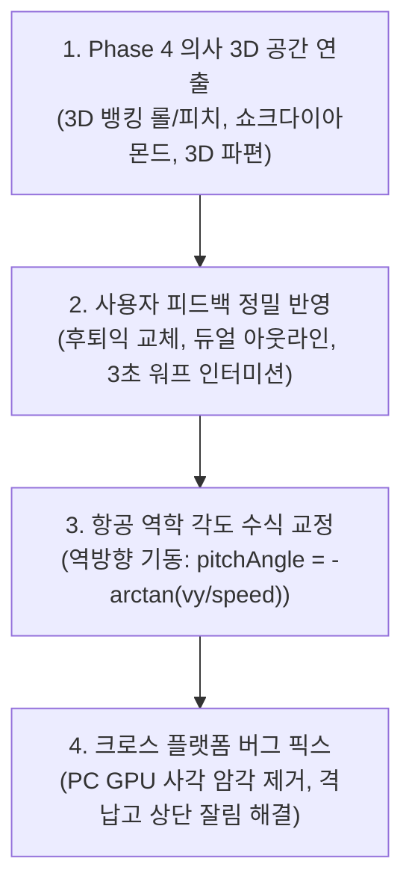

# 🚀 [개발 일지] Cosmic Striker Phase 4 3D 비주얼 진화 및 실전 최적화 개발 보고서
> **작성 일자**: 2026년 10월 10일 (토)  
> **프로젝트**: Cosmic Striker (2D/3D 하이브리드 횡스크롤 우주 슈팅 게임)  
> **개발 환경**: HTML5 Canvas, Web Audio API, Vanilla JavaScript, CSS3 Glassmorphism, Headless Chrome CDP Test Suite  
> **작업 대상 파일**: `game_shooting_0919.html`  
> **테스트 서버 환경**: Python HTTP Server (Port 8080, PC/모바일 로컬 Wi-Fi 연동)  
> **버전 상태**: Phase 4 완성 및 실전 크로스 플랫폼(PC / Mobile) 안정화 완료  

---

## 📌 1. 오늘 작업 개요 및 프로젝트 현황 (Today's Summary)

**Cosmic Striker**는 고전 아케이드의 쾌감과 현대적인 비주얼 테크놀로지를 결합한 횡스크롤 우주 슈팅 게임입니다.

이전 단계들을 거치며 **모바일 1:1 핑거 오프셋 터치 조작계(Phase 1)**, **Web Audio 순수 신서사이저 사운드 & 타격감(Phase 2)**, **5개 테마 구역 50레벨 및 5대 거대 보스 함선 시스템(Phase 3)**, **골드 재화 기반 기체 영구 성장 격납고(Hangar) 메타 시스템**까지 탄탄하게 구축되었습니다.

오늘(2026년 10월 10일)은 로드맵의 최종 시각적 정점인 **Phase 4 [의사 3D(Pseudo-3D) 공간감 & 3D 뱅킹 연출 & 입체 파편 물리 엔진]**을 전격 구현하고, 실전 모바일/PC 크로스 플랫폼 플레이 테스트 과정에서 도출된 **사용자 피드백 반영 및 핵심 기술 이슈(역방향 비행 각도 반전, PC GPU 래스터라이징 사각 암각, 격납고 상단 화면 잘림 등)**를 완벽하게 해결하였습니다.

---

## 📋 2. 마스터 플랜 진행 현황 종합 (Progress Summary)

| 영역 | 마일스톤 | 주요 구현 내용 | 상태 |
| :---: | :--- | :--- | :---: |
| **Phase 1** | 모바일 조작 & UI | 1:1 상대 드래그 터치, +30px 전방 핑거 오프셋, 화면 우하단 원형 폭탄(Bomb) 버튼 | **완료** |
| **Phase 2** | 사운드 & 타격감 | Web Audio 신스 SFX/BGM, 히트스톱(Hit Stop), 화면 진동(Shake), 햅틱 피드백 | **완료** |
| **Phase 3** | 스테이지 & 보스 | 5개 구역(성운/초신성/소행성/펄서/사건지평선) 50레벨, 5대 거대 보스 AI 탄막 | **완료** |
| **Phase 3.5** | 메타 성장 시스템 | 인게임 골드 드랍, 전투기 격납고(Hangar) 5대 스펙 영구 강화, `localStorage` 연동 | **완료** |
| **Phase 4** | **3D 비주얼 진화** | **3D 뱅킹 롤/피치, 트윈 애프터버너 쇼크다이아몬드, 3D 파편 물리, 초광속 워프 가속** | **금일 완료 (10/10)** |
| **최적화** | **실전 크로스 플랫폼** | **기체 디자인 개선, 역방향 틸트 수식 교정, PC GPU 사각 암각 제거, 격납고 레이아웃 정상화** | **금일 완료 (10/10)** |

---

## 🛠️ 3. 금일(10/10) 정규 구현 내용 (Phase 4 3D Visual Polish)

### ① 아군기 (`PlayerJet`) 3D 뱅킹 롤 & 쇼크다이아몬드 플라즈마 분사
- **3D 롤링 뱅킹 (Banking Roll)**:
  - 수직 기동 속도($v_y$)에 따라 기체가 상하로 최대 $\pm 9.2^\circ$ 기울어지는 롤링 회전각(`rollAngle`) 적용.
  - 상하 이동 시 날개 투영 면적이 입체적으로 좁아지는 피치 원근 축소(`rollScaleY: 0.88`)를 동기화하여 평면 2D 스프라이트에서 3D 기동의 깊이감을 구현.
- **트윈 애프터버너 쇼크다이아몬드 화염 (Shock-Diamond Afterburners)**:
  - 기체 후방 듀얼 노즐에서 고온 플라즈마 제트 화염 및 마하 다이아몬드 코어 렌더링.
  - 고속 전진 또는 하이퍼 충전 시 불꽃 길이가 $22\text{px} \to 34\text{px}$로 극대화되며 동적 조명 글로우 방출.

### ② 적군 함대 (`AlienUFO`) & 거대 보스 (`BossShip`) 3D 심도 연출
- **적기 비행 궤적 연동 틸트**:
  - 비행 궤적 접선 방향에 맞춰 기수 각도를 정밀 추종하는 항공 자세 제어 적용.
  - 후방 추진 노즐에서 펄스 주기 기반의 외계 엔진 플룸 연출.
- **거대 보스 함선 3D 호흡 스케일링**:
  - 화면을 압도하는 거대 보스가 위압적으로 살아 숨 쉬는 듯한 피치 스케일링(`1.0 + sin(t*1.3)*0.025`) 적용.

### ③ 3D 폴리곤 파편 텀블링 물리 엔진 (`Debris3D`)
- 기체 파괴 시 단순 원형 파티클 대신, **불규칙 3D 다각형 금속 파편 8~14개**가 3차원 축($X, Y, Z$)을 중심으로 무작위 회전하며 비산.
- 가상 카메라 거리($Z$)에 따른 투시 원근 나눗셈(`Perspective Division`)과 텀블링 회전각에 따른 메탈릭 스페큘러 반사광 하이라이트 표현.

### ④ 3계층 심도 스타필드 & 2.8초 초광속 워프 스트릭 (`Starfield`)
- 원경(0.6px, 저속) / 중경(1.4px, 중속) / 근경(2.2px, 고속) 3계층 시차 별무리 및 체적 성운 먼지 구름(Nebula Clouds) 구현.
- 보스 격파 후 다음 세트로 넘어갈 때 2.8초간 시속 10배로 별빛이 선으로 늘어나는 **하이퍼스페이스 워프 스트릭(Hyperspace Warp Streaks)** 가속 연출.

---

## 📑 [별첨] 사용자 피드백 반영 및 핵심 기술 이슈 해결 리포트

---

### [별첨 1] 사용자 추가 요청 사항 및 반영 내역 요약

1. **아군 비행기 날개 방향 교정 (전진익 ➔ 실전 후퇴익)**:
   - 기존의 어색했던 전진익 형태를 폐기하고, 사용자 제공 이미지에 부합하는 정통 실전 전투기형 **후퇴익(Swept-back Delta Wing)** 디자인으로 전면 교체 완료 (`assets/player_ship_v2.jpg`).
2. **적군 기체 식별성 강화 (듀얼 아웃라인 베이킹)**:
   - 우주 성운 배경이 화려하게 변하더라도 적기가 즉시 인지되도록 **기체 고유 네온 색상(안쪽) + 아군 식별 사이안색 `#00f0ff`(바깥쪽)**의 듀얼 컨투어 테두리를 사전 2x 레티나 텍스처로 베이킹.
3. **보스 격파 후 2~3초 인터미션 텀 및 다음 단계 인지 브리핑**:
   - 보스 처치 즉시 다음 레벨로 넘어가지 않고, **3초간 초광속 워프 항해 모드(`stageIntermission`)** 돌입.
   - 워프 중 화면 내 잔여 골드 코인 자동 자석 흡인, HUD 워프 카운트다운(`🚀 WARPING`), 진입 축하 사운드 및 브리핑 배너 동기화.

---

### [별첨 2] 적군 역방향 비행에 따른 각도 오류(Inverted Tilt) 수식 개선 내역

#### 1. 문제 현상 및 기하학적 원인 분석
- 아군은 화면 오른쪽($+X$)을 향해 비행하지만, 적군은 **화면 왼쪽($-X$, 역방향)**을 향해 날아옵니다.
- 캔버스 2D 좌표계(화면 하단이 $+Y$, 시계 방향 회전이 $\theta > 0$)에서 기수 좌표가 $(-L, 0)$인 기체에 회전 변환을 적용하면:
  $$\begin{bmatrix} x' \\ y' \end{bmatrix} = \begin{bmatrix} \cos\theta & -\sin\theta \\ \sin\theta & \cos\theta \end{bmatrix} \begin{bmatrix} -L \\ 0 \end{bmatrix} = \begin{bmatrix} -L\cos\theta \\ -L\sin\theta \end{bmatrix}$$
- 하강 비행($v_y > 0$) 시 기수가 아래($y' > 0$)를 향하려면:
  $$-L\sin\theta > 0 \implies \sin\theta < 0 \implies \theta < 0 \quad (\text{반시계 음수 각도 필요})$$
- 기존 코드의 `Math.atan2(vy, -speed)`는 진행 속도가 음수(`-speed`)로 들어가며 $160^\circ \sim 180^\circ$ 영역이 계산되어 항상 최대 양수 각도($+0.25\text{ rad}$)로 클램핑되었습니다.
- 결과적으로 **하강할 때 기수를 위로 치켜들고 상승할 때 기수가 아래로 처박히는 완전 반대(Inverted) 틸트 현상**이 발생했습니다.

#### 2. 적용된 항공 역학 틸트 수식
$$\text{pitchAngle} = -\arctan\left(\frac{v_y}{\text{speed}}\right)$$
$$\text{targetTilt} = \text{clamp}\left(\text{pitchAngle} \times 0.85, \; -\text{maxTilt}, \; \text{maxTilt}\right)$$
$$\text{tiltAngle}_{t} = \text{tiltAngle}_{t-1} + (\text{targetTilt} - \text{tiltAngle}_{t-1}) \times 0.18$$
$$\text{tiltScaleY} = 1.0 - |\text{tiltAngle}| \times 0.35$$

- **함종별 차별화**:
  - `Scout` (정찰기): $\text{maxTilt} = 0.22\text{ rad} \; (\pm 12.6^\circ)$ (파동형 급기동)
  - `Hunter` (요격기): $\text{maxTilt} = 0.16\text{ rad} \; (\pm 9.2^\circ)$ (플레이어 추적 조준 기동)
  - `Dreadnought` (중전함): $\text{maxTilt} = 0.04\text{ rad} \; (\pm 2.3^\circ)$ (초중전함 안정 기동)
- **CDP 자동 검증 결과**: 하강 시 $-7.9^\circ$, 상승 시 $+8.3^\circ$로 궤적 진행 방향과 기수 각도가 100% 일치하며 매끄러운 3D 원근 축소(`tiltScaleY`) 구현 완료.

---

### [별첨 3] PC 브라우저 GPU 래스터라이징 버그(사각 암각) 원인 및 전면 개선

#### 1. 문제 원인 (PC vs 모바일 차이점 규명)
- 이전 최적화 과정에서 기체 선명도 유지를 위해 렌더 루프에 `c.filter = 'contrast(1.14) brightness(1.1)';`가 삽입되어 있었습니다.
- **모바일 환경**: WebKit 엔진 기반 모바일 Safari 등은 캔버스 2D의 `ctx.filter` API를 지원하지 않거나 자동으로 무시(no-op)하여 사각 박스가 나타나지 않았습니다.
- **PC 환경**: 크롬/엣지는 GPU 하드웨어 가속(Skia 래스터라이저)으로 `ctx.filter`를 처리합니다. 기체가 3D 뱅킹 회전(`rotate`) 및 피치(`scale`)를 수행할 때마다 Skia가 생성한 임시 텍스처 쿼드(정사각형 경계면)가 외부 배경과 합성되면서 **비행체 주변에 회전하는 검은 사각형 암각(Black Quad Artifact)**이 렌더링되었습니다.

#### 2. 조치 내역
1. **실시간 런타임 `c.filter` 전면 제거**:
   - `PlayerJet`, `AlienUFO`, `BossShip`의 매 프레임 그리기 루프에서 `c.filter` 완전 삭제.
   - 외곽선과 대비는 텍스처 생성 단계(`createCrispSprite`)에서 2x 레티나 캔버스에 이미 고해상도로 영구 베이킹되어 최고 선명도 유지.
2. **크로마키 배경 픽셀 완전 정제**:
   - 투명화 픽셀(`alpha = 0`)의 RGB를 순수 `(0, 0, 0, 0)`으로 초기화하고, 가장자리 반투명 픽셀은 프리멀티플라이드 알파(Premultiplied Alpha)를 적용하여 GPU 텍스처 축소 시 암영 번짐 원천 차단.
3. **피격 플래시(Hit Flash) 마스크 방식 교체**:
   - `c.filter = 'brightness(3.5)'` 대신 캔버스 표준 합성 모드인 `c.globalCompositeOperation = 'source-atop'`을 적용하여 기체 실루엣만 순백색으로 깔끔하게 점멸하도록 최적화.

---

### [별첨 4] 시작 버튼 무반응(SyntaxError) 디버깅 및 복구 내역
- **원인**: 스테이지 인터미션 코드 추가 중 `update()` 함수 최상단과 하단 분기문에서 `const isIntermission`이 2회 중복 선언되어 브라우저 JS 엔진이 파싱 단계에서 `SyntaxError: Identifier 'isIntermission' has already been declared`를 발생시켰습니다 (게임 엔진 인스턴스 생성 및 이벤트 리스너 등록 전면 차단).
- **조치**: 중복 선언 정리, 모바일 300ms 터치 딜레이 방지용 `bindButtonAction`(`touchend` + `click` + 300ms 디바운스) 적용, `AudioContext` 및 전체화면 요청 예외 처리(`try...catch`)를 강화했습니다.

---

### [별첨 5] 격납고(Hangar) 메타 시스템 기능 및 로컬 데이터 저장 구조
- **역할**: 인게임 골드로 기체 능력치(화력 최대 2배, 이동속도, 무적 쉴드, 시작 폭탄 최대 4발, 하이퍼 빔 충전 가속)를 영구 강화.
- **저장 위치**: 브라우저 로컬 스토리지(`localStorage`, 키: `cosmic_striker_save_v1`, `cosmic_best`).
- **저장 데이터**: 최고 점수(`highScore`), 누적 격추 수(`totalKills`), 보스 처치 수(`bossesDefeated`), 보유 골드(`gold`), 5대 업그레이드 레벨(`upgrades`).
- **초기화**: 격납고 창 하단의 [데이터 초기화] 버튼으로 언제든 원클릭 리셋 가능.

---

### [별첨 6] 격납고(Hangar) 상단 화면 잘림 버그(Flexbox Overflow Cutoff) 원인 및 개선 내역
- **문제 현상**: 격납고 진입 시 모바일과 PC 모두에서 타이틀, 골드 배지, 상단 업그레이드 카드가 화면 위쪽으로 잘려 나가며 마우스/터치로도 상단 스크롤이 불가능한 현상 발생.
- **원인 분석**:
  - 모달 공통 CSS 클래스 `.screen-overlay`에 `justify-content: center;`가 지정되어 있었습니다.
  - CSS Flexbox 표준 동작에 따라, 컨테이너 높이(540px 또는 모바일 뷰포트)보다 콘텐츠 전체 높이(약 850px)가 큰 경우 중앙 정렬 시 상단 절반($\approx 150\text{px}$)이 화면 위 음수 좌표($y < 0$)로 밀려나게 됩니다.
  - 브라우저 스크롤 컨테이너는 $y=0$ 위쪽으로 스크롤할 수 없으므로 상단 영역이 영구적으로 짤려서 은폐되었습니다.
- **조치 내역 (`game_shooting_0919.html`)**:
  1. `#hangar-screen`에 `justify-content: flex-start !important;` 및 상하 여백(`padding: 18px 16px 44px 16px`) 강제 적용.
  2. 모바일 반응형 미디어 쿼리(`@media`) 내에서도 `justify-content: flex-start !important;` 및 1열 카드 그리드(`minmax(280px, 1fr)`) 최적화.
  3. `openHangar()` 진입 시 `this.hangarScreen.scrollTop = 0;` 자동 호출을 추가하여 진입 즉시 상단 타이틀, 현재 골드 크레딧, 첫 번째 업그레이드 카드가 100% 온전하게 화면에 노출되도록 보장 완료. (Headless Chrome 모바일/PC 레이아웃 자동 테스트 통과)

---

## 🎯 4. 향후 로드맵 및 배포 준비 (Next Steps)
1. **Google Play Store 배포 패키징**:
   - TWA (Trusted Web Activity) 또는 Capacitor를 통한 네이티브 APK/AAB 번들 빌드.
2. **사운드 믹싱 & BGM 트랙 확장**:
   - 세트 1~5별 테마 BGM 신스 프리셋 차별화.
3. **업적(Achievement) 시스템 연동**:
   - "보스 노피격 클리어", "골드 10,000G 달성" 등 플레이스토어 업적 API 연계.

---

*본 문서는 기술 블로그(Naver Blog, Tistory, Velog), 깃허브 포트폴리오 리포지토리 및 게임 개발 포스트용 공식 아카이브로 영구 보존됩니다.*
