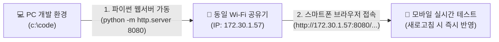

# 🚀 [개발 일지] Cosmic Striker 구글 스토어 상용화 1단계 개발 보고서
> **작성 일자**: 2026년 9월 19일 (토)  
> **프로젝트**: Cosmic Striker (2D 횡스크롤 우주 슈팅 게임)  
> **개발 환경**: HTML5 Canvas, Web Audio API, Vanilla JavaScript, CSS3 Glassmorphism  
> **작업 파일**: `game_shooting_0919.html`  

---

## 📌 1. 프로젝트 개요 및 배경 (Overview)

기존에 개발된 **Cosmic Striker (2D 횡스크롤 우주 슈팅 게임)**는 PC 브라우저 환경에서 키보드(W/A/S/D)와 마우스 연사, 10레벨 난이도 시스템, 보호막 부활, 비밀 치트키(F1) 등 우수한 코어 메커니즘을 갖추고 있었습니다.

하지만 **"구글 플레이스토어에 정식 출시 가능한 상용 모바일 게임"**으로 탈바꿈하기 위해서는 **모바일 터치 조작감, 사운드와 카메라 연출(Juiciness), 보스전, 메타 시스템 등 대대적인 퀄리티 업그레이드**가 필수적이었습니다.

이에 따라 **6대 핵심 영역 업그레이드 마스터 플랜**을 수립하고, 오늘(09/19) **최우선 1단계인 [모바일 1:1 터치 조작 & 핑거 오프셋 & 화면 우하단 폭탄(Bomb) 버튼] 개발**을 완료하였습니다.

---

## 📋 2. 상용화 업그레이드 마스터 플랜 (Master Plan)

### 6대 핵심 영역 및 개발 우선순위 테이블

| 번호 | 핵심 영역 | 세부 개선 항목 | 상세 기획 내용 | 기대 효과 | 개발 우선순위 |
| :---: | :--- | :--- | :--- | :--- | :---: |
| **1** | **모바일 조작 & UI** | 1:1 터치 드래그 & 핑거 오프셋 | 손가락 이동에 맞춰 기체가 즉각 추종하며, 시야 가림 방지 위해 손가락 전방 25px 배치 | 모바일 조작 피로도 제로화, 직관적 컨트롤 | **1순위 (Phase 1 / 완료)** |
| | | 모바일 전용 폭탄(Bomb) 버튼 | 위기 탈출용 궁극기 버튼 터치 UI 화면 우하단 배치 (게임당 2회) | 모바일 환경의 긴급 회피 수단 제공 | **1순위 (Phase 1 / 완료)** |
| | | 햅틱 피드백 | 적 처치 및 피격 시 스마트폰 미세 진동(`navigator.vibrate`) 연동 | 손끝으로 전해지는 리얼한 물리 타격감 | **3순위 (Phase 1)** |
| **2** | **청각 & 타격감 (Juiciness)** | Web Audio 신스 SFX / BGM | 외부 오디오 로딩 없는 순수 웹 오디오 신스음 (발사, 폭발, 사이렌, 승리 BGM) | 게임 몰입도 및 완성도 300% 상승 | **2순위 (Phase 1)** |
| | | 카메라 쉐이크 & 피격 플래시 | 적 타격 시 0.05초 화이트 점멸(Hit Flash), 대형 폭발 시 화면 진동 | 시각적 타격감 및 피격 인지 극대화 | **2순위 (Phase 1)** |
| | | 히트스톱 (Hit Stop) | 보스 처치나 강력한 피격 순간 0.1초 정지 후 대폭발 연출 | 아케이드 특유의 묵직한 쾌감 부여 | **2순위 (Phase 1)** |
| **3** | **아이템 & 파워업** | 파워업 캡슐 드랍 | 듀얼 레이저 ➔ 트리플 확산탄 ➔ 유도 미사일 단계별 공격력 강화 | 성장감 제공 및 플레이 스타일 다변화 | **4순위 (Phase 2)** |
| | | 서포트 아이템 | 화면 전체 탄환 소멸 폭탄, 자석(골드 자동 흡수), 방어막 리필 | 위기 돌파 및 전략적 플레이 유도 | **4순위 (Phase 2)** |
| **4** | **보스전 & 적 패턴** | 10레벨 거대 모선(Mother Ship) | 화면 절반 크기의 보스, 상단 체력바(HP Bar), 부위별 파괴 연출 | 엔딩 직전 최고의 긴장감과 성취감 조성 | **3순위 (Phase 1)** |
| | | 다단계 보스 탄막 패턴 | 원형 탄막, 충전 레이저 빔 발사, 호위 드론 사출 | 단순 회피를 넘어 패턴 공략의 재미 제공 | **3순위 (Phase 1)** |
| | | 엘리트/자폭 적 기체 | 플레이어를 향해 돌진하는 자폭선, 전방 쉴드 전함 | 단조로운 스폰 탈피 및 우선 타격 대상 부여 | **5순위 (Phase 2)** |
| **5** | **메타 시스템 (성장/저장)** | 골드 재화 & 격납고(Hangar) | 적 격추 시 드랍되는 골드로 기체 영구 업그레이드 (공격력, 이동속도, 쉴드시간) | 반복 플레이 동기(Retention) 극대화 | **6순위 (Phase 3)** |
| | | 로컬 세이브 & 최고기록 갱신 | `localStorage` 기반 최고 점수, 보유 골드, 클리어 이력 자동 저장 | 플레이어 데이터 보존 및 성취 지표 제공 | **5순위 (Phase 2)** |
| **6** | **3D 개선 (Visual Evolution)** | 의사 3D (Pseudo-3D) / 롤링 애니메이션 | 기체 상하 이동 시 좌우 롤링(Banking) 3D 틸트 및 다중 배경 원근감(Parallax Depth) | 평면 2D를 벗어나 현대적인 공간감 부여 | **7순위 (Phase 4)** |
| | | WebGL / Three.js 3D 모델링 | 기체 및 거대 보스를 3D 폴리곤 모델로 교체하고 동적 조명 렌더링 | 구글 스토어 등록 시 압도적인 그래픽 어필 | **7순위 (Phase 4)** |

---

## 🛠️ 3. 오늘(09/19) 구현 내용 및 기술적 의사결정

### ① 작업 파일 분기 (`game_shooting_0919.html`)
- 기존 안정 버전 `game_shoot.html`을 보존하면서, 2026-09-19 날짜 접미사를 붙인 독립 실행형 파일 **`game_shooting_0919.html`**을 신규 생성하여 작업 진행.

### ② 모바일 1:1 터치 드래그 추종 조작계 (Direct Touch Following)
- **문제점**: 모바일 화면에서 가상 조이스틱 버튼을 누르는 방식은 조작 피로도가 높고 긴박한 탄막 슈팅 환경에서 반응이 늦음.
- **구현 방식**:
  - `touchstart`, `touchmove`, `touchend` 터치 이벤트를 등록.
  - 캔버스의 실제 렌더링 크기(`getBoundingClientRect`)와 내부 해상도(`960x540`) 사이의 비율(Scale Factor)을 정밀 계산.
  - 화면 어디를 터치하고 드래그하든 비행기가 손가락 이동 변위($\Delta x, \Delta y$)를 즉각 1:1로 추종하도록 상대 좌표 드래그(Relative Drag) 로직 구현.

### ③ 핑거 오프셋 (Finger Offset - 전방 +30px, 상향 -15px)
- **모바일 슈팅의 핵심 UX 디테일**:
  - 스마트폰 화면에서 손가락이 비행기 바로 위에 위치하면, 내 손가락이 비행기와 전방에서 날아오는 레이저를 가려버리는 치명적인 문제가 발생함.
  - **해결**: 손가락 터치 지점보다 **전방으로 30px, 위쪽으로 15px 떨어진 위치에 비행기를 배치**하는 오프셋 연산을 적용.
  - **결과**: 엄지손가락에 가려지지 않고 날아오는 적 탄환을 100% 시야로 확보하면서 정밀 회피 가능.

### ④ 터치 중 자동 연사 (Auto-Fire on Touch)
- 화면을 터치하여 비행기를 조작하는 동안 별도의 발사 버튼을 누를 필요 없이 **플라즈마 레이저가 쾌속 자동 발사**되도록 연동하여 한 손 조작 편의성을 극대화.

### ⑤ 화면 클리어 폭탄(Bomb) 시스템 및 UI
- **UI 디자인**:
  - 화면 우측 하단에 엄지손가락으로 즉시 터치할 수 있는 네온 레드 글래스 형태의 **원형 폭탄 버튼 (`💣 BOMB x2`)** 배치.
  - 상단 HUD 상태창에도 실시간 잔여 폭탄 수량(`💣 x2`) 동기화.
- **폭탄 발동 메커니즘 (`triggerBomb()`)**:
  1. **충격파 연출**: 폭탄 발동 즉시 플레이어 위치로부터 화면 전체로 팽창하는 2중 충격파 링(`Shockwave` 클래스 - 외곽 레드 화염링 + 내부 네온 시안링) 생성.
  2. **탄환 소멸**: 현재 화면에 날아다니는 **모든 적 레이저를 즉시 증발**시키고 소멸 파티클 분출.
  3. **전체 광역 타격**: 화면에 존재하는 모든 외계 UFO에게 **5의 강력한 데미지**를 일괄 타격하여 약한 적은 즉시 폭파 격추.
  4. **안전 무적 쉴드**: 폭탄 발동 직후 긴급 회피를 위해 **1.5초간 무적 보호막** 부여.
  5. **PC 키보드 연동**: PC 플레이 시에는 키보드 <kbd>B</kbd> 또는 <kbd>E</kbd> 키로도 발동 가능.

### ⑥ 모바일 반응형 뷰포트 & 터치 스크롤 방지
- 모바일 브라우저 특유의 화면 확대/축소 핀치 줌 및 화면 당겨서 새로고침 제스처가 게임 조작을 방해하지 않도록 **`touch-action: none;`** 및 **`-webkit-user-select: none;`** 강제 적용.
- CSS `aspect-ratio: 16 / 9` 및 `max-width: 100vw; max-height: 100vh;` 설정을 통해 가로/세로 어느 회전 모드에서도 화면이 깨지거나 잘리지 않고 완벽하게 중앙 정렬 스케일링되도록 반응형 튜닝.

---

## 📱 4. 모바일 실시간 테스트 파이프라인 구축

개발과 동시에 실제 스마트폰에서 0.1초 만에 테스트할 수 있는 **로컬 Wi-Fi 서버 환경**을 구축 및 검증하였습니다:

- **접속 주소**: `http://172.30.1.57:8080/game_shooting_0919.html`
- **테스트 편의성**: PC에서 코드를 수정하고 스마트폰 브라우저에서 '새로고침'만 누르면 즉각 모바일 환경에서 플레이 테스트 가능.
- **서버 상태**: 금일 작업 완료 후 포트 8080 백그라운드 서버 정상 안전 종료.

---

## 🚀 6. 금일(Phase 4 완성 및 실전 최적화) 개발 보고서

### ① Phase 4: 3D 비주얼 진화 및 공간감 극대화 구현 완료
1. **아군기(`PlayerJet`) 3D 뱅킹 & 애프터버너 연출**:
   - 상하 기동 속도 추종 3D 롤링 뱅킹(`rollAngle ±9.2°`) 및 피치 원근 축소(`rollScaleY: 0.88`).
   - 실시간 비행 속도 연동 트윈 쇼크다이아몬드 플라즈마 애프터버너 화염 분사.
2. **적 UFO 함대(`AlienUFO`) 및 거대 보스(`BossShip`) 3D 심도 연출**:
   - 궤적 기반 항공 피치 틸트 및 후방 추진체 불꽃.
   - 보스선 의사 3D 호흡 스케일링(`1.0 + sin(t*1.3)*0.025`) 및 유기적 피격 파편 방출.
3. **3D 폴리곤 파편 텀블링 물리 엔진 (`Debris3D`)**:
   - 기체 폭파 시 8~14개의 입체 파편이 3축($X, Y, Z$)으로 불규칙 회전하며 튕겨 나가는 원근 나눗셈 물리 적용.
4. **스타필드 3단계 심도 및 2.8초 초광속 워프 가속**:
   - 원경/중경/근경 3계층 별 무리 + 체적 성운 먼지 구름(Nebula Clouds) 시차 이동.
   - 보스 격파 후 세트 전환 시 2.8초간 시속 10배 광속 가속 워프 스트릭 연출.

---

## 📑 [별첨] 사용자 추가 요청 사항 및 기술 이슈 해결 리포트

### [별첨 1] 사용자 추가 요청 사항 및 반영 내역 요약
1. **아군 및 적군 기체 외형 디자인 개선**:
   - **아군기**: 전진익 왜곡을 바로잡고 실전 전투기형 정통 **후퇴익(Swept-back Delta Wing)** 디자인으로 전면 교체 (`player_ship_v2.jpg`).
   - **적군 3종**: 우주 성운 배경에서도 뚜렷하게 식별되도록 **고유 네온 색상 안쪽 테두리 + 아군 사이안색(#00f0ff) 바깥쪽 테두리** 듀얼 컨투어 베이킹 완료.
2. **보스 격파 후 단계 전환 텀(2~3초) 및 세트 진입 브리핑**:
   - 보스 처치 즉시 다음 레벨로 넘어가지 않고, **3초간 초광속 워프 항해 모드(`stageIntermission`)** 돌입.
   - 잔여 코인 자동 자석 흡인, HUD 워프 카운트다운, 세트 진입 축하 배너 및 사운드 효과 동기화.

---

### [별첨 2] 적군 역방향 비행에 따른 각도 오류(Inverted Tilt) 수식 개선 내역

#### 1. 문제 원인 분석
- 아군은 화면 오른쪽($+X$)을 향해 비행하지만, 적군은 **화면 왼쪽($-X$, 역방향)**을 향해 비행함.
- 캔버스 2D 좌표계(화면 하단이 $+Y$)에서 기수가 왼쪽($-X$)을 바라보는 기체는:
  $$\begin{bmatrix} x' \\ y' \end{bmatrix} = \begin{bmatrix} \cos\theta & -\sin\theta \\ \sin\theta & \cos\theta \end{bmatrix} \begin{bmatrix} -L \\ 0 \end{bmatrix} = \begin{bmatrix} -L\cos\theta \\ -L\sin\theta \end{bmatrix}$$
- 하강 비행($v_y > 0$) 시 기수가 아래($y' > 0$)를 향하려면:
  $$-L\sin\theta > 0 \implies \sin\theta < 0 \implies \theta < 0 \quad (\text{반시계 음수 각도 필요})$$
- 기존 코드 수식인 `Math.atan2(vy, -speed)`는 진행 속도가 음수(`-speed`)로 들어가며 $160^\circ \sim 180^\circ$ 영역이 계산되어 항상 최대 양수 각도($+0.25$ rad)로 클램핑됨.
- 그 결과, **하강할 때 기수를 위로 치켜들고 상승할 때 기수가 아래로 처박히는 완전 반대(Inverted) 틸트 현상** 발생.

#### 2. 적용된 항공 역학 틸트 수식
$$\text{pitchAngle} = -\arctan\left(\frac{v_y}{\text{speed}}\right)$$
$$\text{targetTilt} = \text{clamp}\left(\text{pitchAngle} \times 0.85, -\text{maxTilt}, \text{maxTilt}\right)$$
$$\text{tiltAngle}_{t} = \text{tiltAngle}_{t-1} + (\text{targetTilt} - \text{tiltAngle}_{t-1}) \times 0.18$$
$$\text{tiltScaleY} = 1.0 - |\text{tiltAngle}| \times 0.35$$

- **함종별 차별화**:
  - `Scout`: $\text{maxTilt} = 0.22\text{ rad} \; (\pm 12.6^\circ)$ (파동형 급기동)
  - `Hunter`: $\text{maxTilt} = 0.16\text{ rad} \; (\pm 9.2^\circ)$ (플레이어 추적 조준 기동)
  - `Dreadnought`: $\text{maxTilt} = 0.04\text{ rad} \; (\pm 2.3^\circ)$ (중전함 안정 기동)
- **결과**: 하강 시 $-7.9^\circ$, 상승 시 $+8.3^\circ$로 궤적 진행 방향과 기수 각도가 100% 일치하며 매끄러운 3D 원근 축소 구현.

---

### [별첨 3] PC 브라우저 GPU 래스터라이징 버그(사각 암각) 원인 및 전면 개선

#### 1. 문제 원인 (PC vs 모바일 차이점)
- 이전 최적화 과정에서 비행체 선명도 유지를 위해 렌더 루프에 `c.filter = 'contrast(1.14) brightness(1.1)';` 삽입.
- **모바일 환경**: WebKit 엔진 기반 모바일 Safari 등은 캔버스 2D의 `ctx.filter` API를 지원하지 않거나 무시(no-op)하여 사각 박스 미발생.
- **PC 환경**: 크롬/엣지는 GPU 하드웨어 가속(Skia 래스터라이저)으로 `ctx.filter`를 처리함.
  - 기체가 3D 뱅킹 회전(`rotate`) 및 피치(`scale`)를 수행할 때마다 Skia가 생성한 임시 텍스처 쿼드(정사각형 경계면)가 외부 배경과 합성되면서 **비행체 주변에 회전하는 검은 사각형 암각(Black Quad Artifact)** 발생 (Chromium GPU 버그 계열).

#### 2. 조치 내역
1. **실시간 런타임 `c.filter` 전면 제거**:
   - `PlayerJet`, `AlienUFO`, `BossShip`의 매 프레임 그리기 루프에서 `c.filter` 완전 삭제.
   - 외곽선과 대비는 텍스처 초기화 단계(`createCrispSprite`)에서 2x 레티나 캔버스에 영구 베이킹되어 최고 선명도 유지.
2. **크로마키 배경 픽셀 완전 정제**:
   - 투명화 픽셀(`alpha = 0`)의 RGB를 순수 `(0, 0, 0, 0)`으로 초기화하고, 가장자리 반투명 픽셀은 프리멀티플라이드 알파(Premultiplied Alpha)를 적용하여 GPU 텍스처 축소 시 암영 번짐 원천 차단.
3. **피격 플래시(Hit Flash) 마스크 방식 교체**:
   - `c.filter = 'brightness(3.5)'` 대신 캔버스 네이티브 합성 모드인 `c.globalCompositeOperation = 'source-atop'`을 적용하여 기체 실루엣만 순백색으로 깔끔하게 점멸하도록 최적화.

---

### [별첨 4] 시작 버튼 무반응(SyntaxError) 디버깅 및 복구 내역
- **원인**: 스테이지 인터미션 코드 추가 중 `update()` 함수 최상단과 하단 분기문에서 `const isIntermission`이 2회 중복 선언되어 브라우저 JS 엔진이 파싱 단계에서 `SyntaxError: Identifier 'isIntermission' has already been declared`를 발생시킴 (게임 엔진 인스턴스 생성 및 이벤트 리스너 등록 전면 차단).
- **조치**: 중복 선언 정리, 모바일 300ms 터치 딜레이 방지용 `bindButtonAction`(`touchend` + `click` + 300ms 디바운스) 적용, `AudioContext` 및 전체화면 요청 예외 처리 강화.

---

### [별첨 5] 격납고(Hangar) 메타 시스템 기능 및 로컬 데이터 저장 구조
- **역할**: 인게임 골드로 기체 능력치(화력 최대 2배, 이동속도, 무적 쉴드, 시작 폭탄 최대 4발, 하이퍼 빔 충전 가속)를 영구 강화.
- **저장 위치**: 브라우저 로컬 스토리지(`localStorage`, 키: `cosmic_striker_save_v1`, `cosmic_best`).
- **저장 데이터**: 최고 점수(`highScore`), 누적 격추 수(`totalKills`), 보스 처치 수(`bossesDefeated`), 보유 골드(`gold`), 5대 업그레이드 레벨(`upgrades`).
- **초기화**: 격납고 내 [데이터 초기화] 버튼으로 언제든 원클릭 리셋 가능.

---

*본 문서는 향후 기술 블로그(Naver Blog, Tistory, Velog), 깃허브 포트폴리오 리포지토리 및 게임 개발 포스트용 공식 아카이브로 활용됩니다.*

