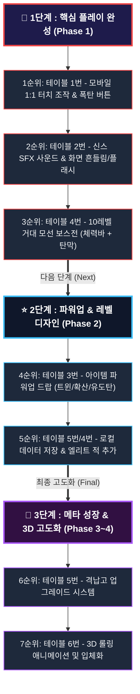

# 🚀 Cosmic Striker 상용화 업그레이드 마스터 플랜

> **Google Play Store 출시를 위한 2D 우주 횡스크롤 슈팅 게임 고도화 기획서**

---

## 1. 6대 핵심 영역 업그레이드 로드맵 테이블

| 번호 | 핵심 영역 | 세부 개선 항목 | 상세 기획 내용 | 기대 효과 | 개발 우선순위 |
| :---: | :--- | :--- | :--- | :--- | :---: |
| **1** | **모바일 조작 & UI** | 1:1 터치 드래그 & 핑거 오프셋 | 손가락 이동에 맞춰 기체가 즉각 추종하며, 시야 가림 방지 위해 손가락 전방 25px 배치 | 모바일 조작 피로도 제로화, 직관적 컨트롤 | **1순위 (Phase 1)** |
| | | 모바일 전용 폭탄(Bomb) 버튼 | 위기 탈출용 궁극기 버튼 터치 UI 화면 우하단 배치 (게임당 2회) | 모바일 환경의 긴급 회피 수단 제공 | **1순위 (Phase 1)** |
| | | 햅틱 피드백 | 적 처치 및 피격 시 스마트폰 미세 진동(`navigator.vibrate`) 연동 | 손끝으로 전해지는 리얼한 물리 타격감 | **3순위 (Phase 1)** |
| **2** | **청각 & 타격감 (Juiciness)** | Web Audio 신스 SFX / BGM | 외부 오디오 로딩 없는 순수 웹 오디오 신스음 (발사, 폭발, 사이렌, 승리 BGM) | 게임 몰입도 및 완성도 300% 상승 | **2순위 (Phase 1)** |
| | | 카메라 쉐이크 & 피격 플래시 | 적 타격 시 0.05초 화이트 점멸(Hit Flash), 대형 폭발 시 화면 진동 | 시각적 타격감 및 피격 인지 극대화 | **2순위 (Phase 1)** |
| | | 히트스톱 (Hit Stop) | 보스 처치나 강력한 피격 순간 0.1초 정지 후 대폭발 연출 | 아케이드 특유의 묵직한 쾌감 부여 | **2순위 (Phase 1)** |
| **3** | **아이템 & 파워업** | 파워업 캡슐 드랍 | 듀얼 레이저 ➔ 트리플 확산탄 ➔ 유도 미사일 단계별 공격력 강화 | 성장감 제공 및 플레이 스타일 다변화 | **4순위 (Phase 2)** |
| | | 서포트 아이템 | 화면 전체 탄환 소멸 폭탄, 자석(골드 자동 흡수), 방어막 리필 | 위기 돌파 및 전략적 플레이 유도 | **4순위 (Phase 2)** |
| **4** | **보스전 & 적 패턴** | 10레벨 거대 모선(Mother Ship) | 화면 절반 크기의 보스, 상단 체력바(HP Bar), 부위별 파괴 연출 | 엔딩 직전 최고의 긴장감과 성취감 조성 | **3순위 (Phase 1)** |
| | | 다단계 보스 탄막 패턴 | 원형 탄막, 충전 레이저 빔 발사, 호위 드론 사출 | 단순 회피를 넘어 패턴 공략의 재미 제공 | **3순위 (Phase 1)** |
| | | 엘리트/자폭 적 기체 | 플레이어를 향해 돌진하는 자폭선, 전방 쉴드 전함 | 단조로운 스폰 탈피 및 우선 타격 대상 부여 | **5순위 (Phase 2)** |
| **5** | **메타 시스템 (성장/저장)** | 골드 재화 & 격납고(Hangar) | 적 격추 시 드랍되는 골드로 기체 영구 업그레이드 (공격력, 이동속도, 쉴드시간) | 반복 플레이 동기(Retention) 극대화 | **6순위 (Phase 3)** |
| | | 로컬 세이브 & 최고기록 갱신 | `localStorage` 기반 최고 점수, 보유 골드, 클리어 이력 자동 저장 | 플레이어 데이터 보존 및 성취 지표 제공 | **5순위 (Phase 2)** |
| **6** | **3D 개선 (Visual Evolution)** | 의사 3D (Pseudo-3D) / 롤링 애니메이션 | 기체 상하 이동 시 좌우 롤링(Banking) 3D 틸트 및 다중 배경 원근감(Parallax Depth) | 평면 2D를 벗어나 현대적인 공간감 부여 | **7순위 (Phase 4)** |
| | | WebGL / Three.js 3D 모델링 | 기체 및 거대 보스를 3D 폴리곤 모델로 교체하고 동적 조명 렌더링 | 구글 스토어 등록 시 압도적인 그래픽 어필 | **7순위 (Phase 4)** |

---

## 2. 단계별 계단식 개발 파이프라인 (Visual Pipeline)

---

## 3. 기획자 추천 "가장 먼저 시도해볼 단계" Rationale

1. **1순위 (테이블 1번): 모바일 1:1 터치 조작 & 폭탄 버튼**
   - 모바일 스토어 출시의 최우선 기본기입니다. 손가락 터치 드래그 추종 및 핑거 오프셋을 적용해야 실제 스마트폰 기기에서 정상적인 조작 테스트가 가능합니다.
2. **2순위 (테이블 2번): 사운드(SFX/BGM) & 화면 흔들림/피격 플래시**
   - 가장 적은 개발 공수로 체감 완성도를 300% 끌어올릴 수 있는 영역입니다. Web Audio 기반 신스음으로 별도 파일 로딩 없이 가볍고 강렬한 타격감을 구현합니다.
3. **3순위 (테이블 4번): 10레벨 거대 모선 보스전 (체력바 + 패턴)**
   - 단순 10초 생존이 아닌 진짜 보스를 격파하는 성취감을 주며, 승리 왕관 화면으로 이어지는 스토리적 완결성을 부여합니다.
